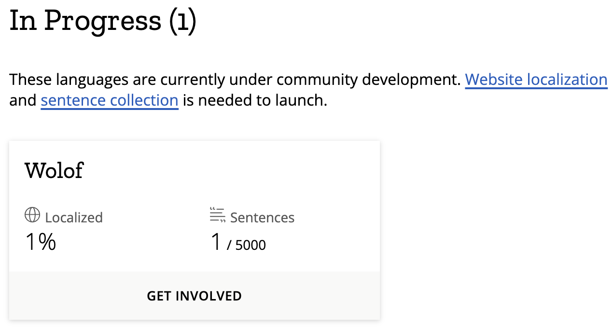

[](https://creativecommons.org/licenses/by/4.0/)


# Wolof-Common-Voice
Wolof Text Data Collection for recording on the Mozilla [Common Voice](https://commonvoice.mozilla.org/) platform.  
The data comes from the [Masakhane](https://www.masakhane.io/)'s corpus collected as part of the [MasakhaNER project](https://github.com/masakhane-io/lacuna_pos_ner).


# Structure
The project is structured as follows:
```
.
├── data/
│   └── raw <- initial data from the MasakhaNER project (cf eda-cleaning.ipynb)
│   ├── intermediate <- cleaned and adapted data to common voice specifications
│   ├── processed <- ready to upload data
├── illustration/ <- contained images used as illusrations in the Readme
│   └── common-voice.png
│   ├── wolof.png
├── eda-cleaning.ipynb <- Notebook used for data preparation
```
# Upload
`Processed` data have to be uploaded directly on [Common Voice](https://commonvoice.mozilla.org/wo/write) in the `sentence collection` section for review __by users__. They have to be splitted first into sentences so that they can be recorded in the best conditions prescribed by Mozilla:

* [No copyright](https://en.wikipedia.org/wiki/Public_domain) restrictions ([cc-0](https://creativecommons.org/public-domain/cc0/)) ;
* Fewer than 15 words per sentence ;
* Use correct grammar ;
* Use correct spelling and punctuation ;
* No numbers and special characters ;
* No foreign letters ;
* Include appropriate citation ;
* Ideally natural and conversational (it should be easy to read the sentence).

# ToDo
The corpus after processing (intermediate) contains `13391 sentences` in total: __2391__ in [part 1](data/intermediate/wolof_to_upload_part1.txt) and __11000__ in [part 2](data/intermediate/wolof_to_upload_part2.txt). We currently need to:

- [ ] Split the data (part 2) into batches of 2000 sentences  
- __For each batch:__  
    - [ ] Clean the data to remove punctuation, special characters, numbers and abbreviations
        - For __abbreviations__, you could use these regex to identify them: `(?:[a-zA-Z]\.){2,}`
    - [ ] Ensures that sentences do not exceed 14 words in length  
    - [ ] Makes sure the sentences make sense to facilitate recording  
- [ ] Write a Wolof reading guide to enable users to read correctly  
- [ ] Making a tutorial on how to get started with the common voice platform  
- [ ] Organize a datathon to catalyze data collection 
- Progress of batch cleaning:
    - [x] Batch 1: [`2,391 sentences`](data/processed/batches/batch-1.txt)
    - [ ] Batch 2: `2,000 sentences`
    - [ ] Batch 3: `2,000 sentences`
    - [ ] Batch 4: `2,000 sentences`
    - [ ] Batch 5: `2,000 sentences`
    - [ ] Batch 6: `2,000 sentences`
    - [ ] Batch 7: `1,000 sentences`

> Wolof is now referenced on Common Voice and you can enter your email on the platform to follow the progress of the project 🥳


# Replicate this project for your language
If you wish to have your language referenced on Common Voice, just go to the platform and click on `LANGUAGES` then `Request a Language`. Fill in the information and wait for the Mozilla team to contact you. You will then have to open a [Github Issue](https://docs.github.com/en/issues/tracking-your-work-with-issues/about-issues) for [language localization](https://commonvoice.mozilla.org/en/faq#localization) and fill a template. When you get to this stage, you can use [our template](https://github.com/common-voice/common-voice/issues/3861) as inspiration to fill yours.

You will then have to collect textual data in your language and upload them to the sentence collector taking into account the prerequisites advised by Mozilla (cf [Upload section](#upload)).
For optimal recording conditions, we advise you to also follow the indications provided in [this document](https://archive.fosdem.org/2022/schedule/event/mozilla_language_common_voice/attachments/slides/5033/export/events/attachments/mozilla_language_common_voice/slides/5033/common_voice_turkish_slides.pdf).

> If you need any feedback, you can send us an email at galsenaimeetups[at]gmail[dot]com

# License
<a rel="license" href="http://creativecommons.org/licenses/by-sa/4.0/"></a><br />This work is licensed under a <a rel="license" href="http://creativecommons.org/licenses/by-sa/4.0/">Creative Commons Attribution-ShareAlike 4.0 International License</a>.

